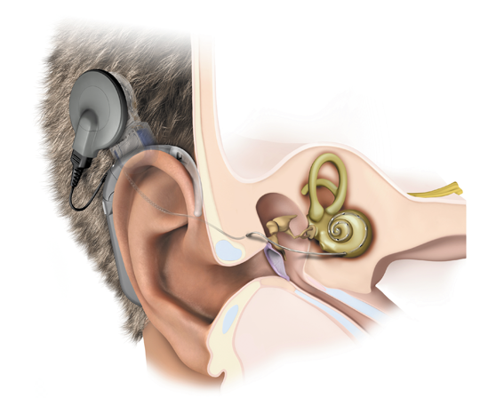
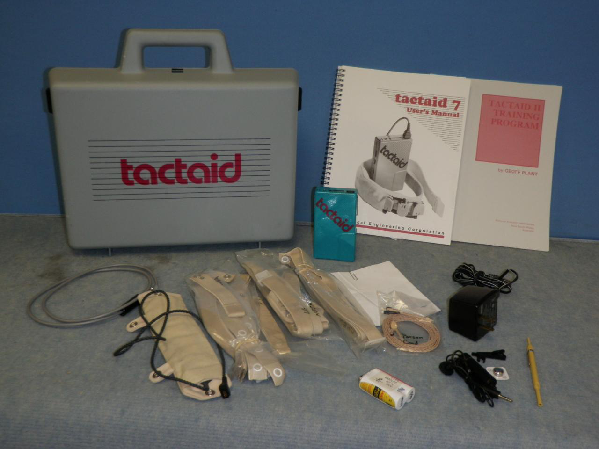
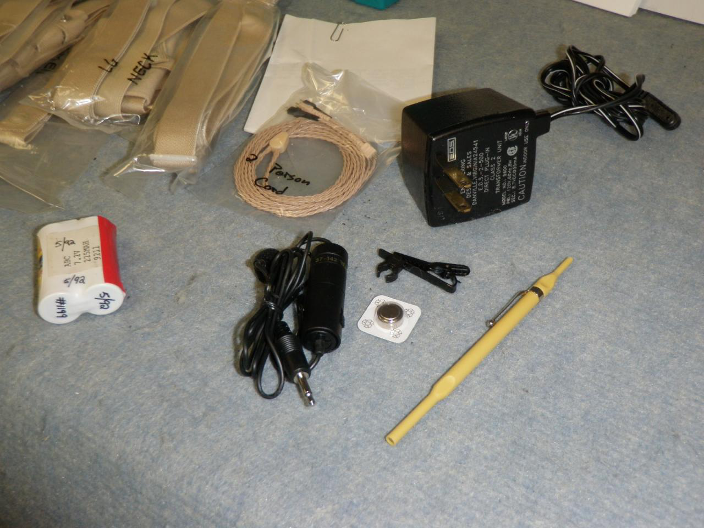
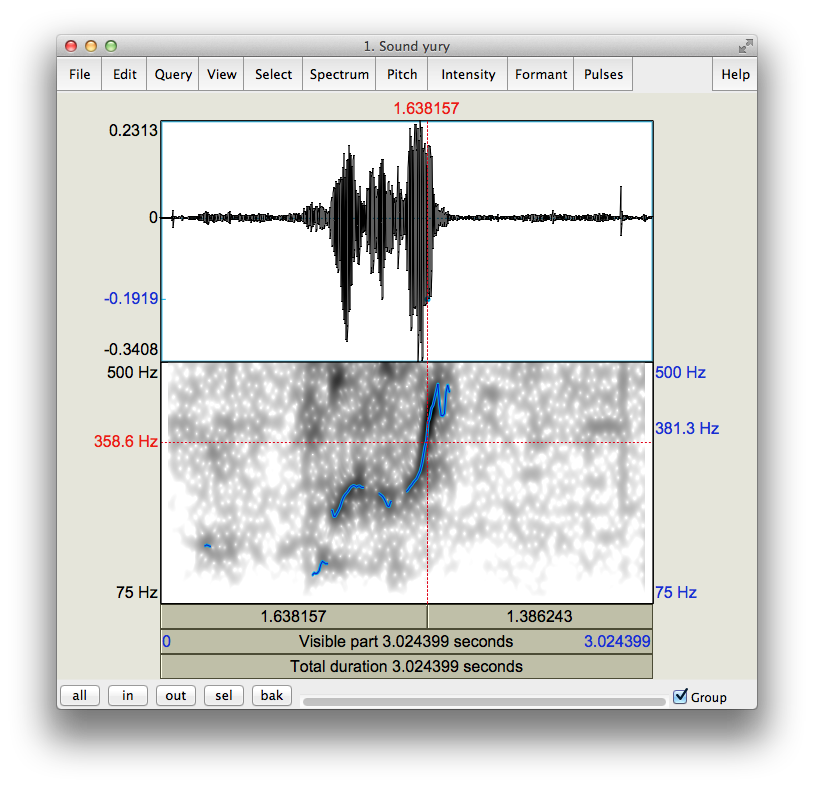
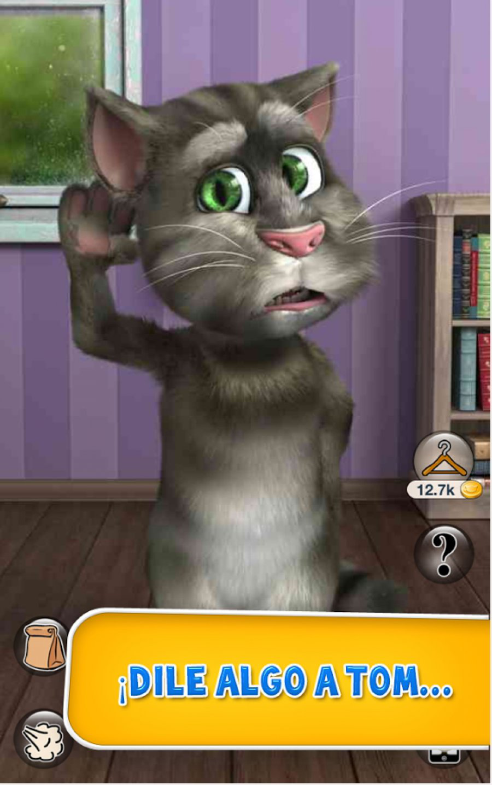
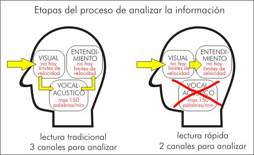
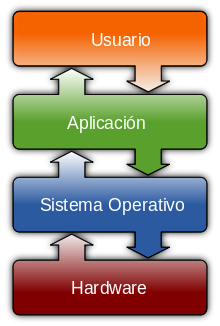

## Habilitador oral para personas con discapacidades auditivas

David Ricardo Martinez Hernandez

Slide:

# Indice

## Estado del Arte

## Aplicaciones

## Metodología

## Referencias

Slide:

# Estado del arte

1. Implantes Cocleares
2. TACTAID
3. Pauper Tango

Subslide:

## Estado del Arte
### Implantes Cocleares

Tomado de [http://www.nncn.de/en/news/Forschungsergebnisse-en/cochleaimplantate?set_language=en](http://www.nncn.de/en/news/Forschungsergebnisse-en/cochleaimplantate?set_language=en)

Subslide:

## Estado del Arte
### TACTAID

Tomado de [http://www.biggerbids.com/auction-image-gallery.php?auction_id=789237&image_id=4792986](http://www.biggerbids.com/auction-image-gallery.php?auction_id=789237&image_id=4792986)

Subslide:

## Estado del Arte
### TACTAID

Tomado de [http://www.biggerbids.com/auction-image-gallery.php?auction_id=789237&image_id=4792986](http://www.biggerbids.com/auction-image-gallery.php?auction_id=789237&image_id=4792986)

Slide:

## Aplicaciones
### Praat

Subslide:

## Aplicaciones
### Talking Tom Cat 2

Tomado de [http://talking-tom-cat-2-free.uptodown.com/android](http://talking-tom-cat-2-free.uptodown.com/android)

Subslide:
## Aplicaciones
### Pauper Tango

* Dispositivo muy similar a TACTAID.
* Consta de un Digital Signal Processor (DSP) DSP56002.
* Pre-procesamiento de la señal.
* Detección de la $F_0$.
* Oscilador.
* Vibradores.

Slide:
# Metodología

Subslide:

* Identificación de la oralización.

Tomado de [http://cursos-musica.vivavisos.com.ar/cursos-actuacion-danza+pilar/clases-de-canto-y-vocalizacion/24877232](http://cursos-musica.vivavisos.com.ar/cursos-actuacion-danza+pilar/clases-de-canto-y-vocalizacion/24877232)

Subslide:

# Metodología

* Diseño conceptual de la herramienta.

Tomado de [http://readerssoft.com/es/obstaculos_de_lectura_veloz.php](http://readerssoft.com/es/obstaculos_de_lectura_veloz.php)

Subslide:

# Metodología

* Diseño del algoritmo.

Tomado de [http://www.taringa.net/posts/apuntes-y-monografias/17400159/Explicacion-perfecta-de-que-es-un-algoritmo.html](http://www.taringa.net/posts/apuntes-y-monografias/17400159/Explicacion-perfecta-de-que-es-un-algoritmo.html)

Subslide:

# Metodología

* Partición Herdare-Software.

Tomado de [http://ensamble321.blogspot.com/2012/11/sistema-operativo-particion-formateo-y.html](http://ensamble321.blogspot.com/2012/11/sistema-operativo-particion-formateo-y.html)

Subslide:

# Metodología

* Interfaz gráfica.

Subslide:

# Metodología

* Desarrollo del HandBook.

Tomado de: [http://www.taringa.net/posts/ciencia-educacion/16807559/LaTeX-te-parece-muy-complicado-Entra.html](http://www.taringa.net/posts/ciencia-educacion/16807559/LaTeX-te-parece-muy-complicado-Entra.html)

Slide:
# Referencias

* [Pauper Tango](https://revistaing.uniandes.edu.co/pdf/Rv16-A3.pdf)
* [TACTAID](https://minerva-access.unimelb.edu.au/handle/11343/27587)
* [Talking Tom cat 2](http://talking-tom-cat-2-free.uptodown.com/android)
* [Vibrotactile Stimulation: Case Study with a Profoundly Deaf Child](http://www.rehab.research.va.gov/jour/86/23/1/pdf/geers.pdf)